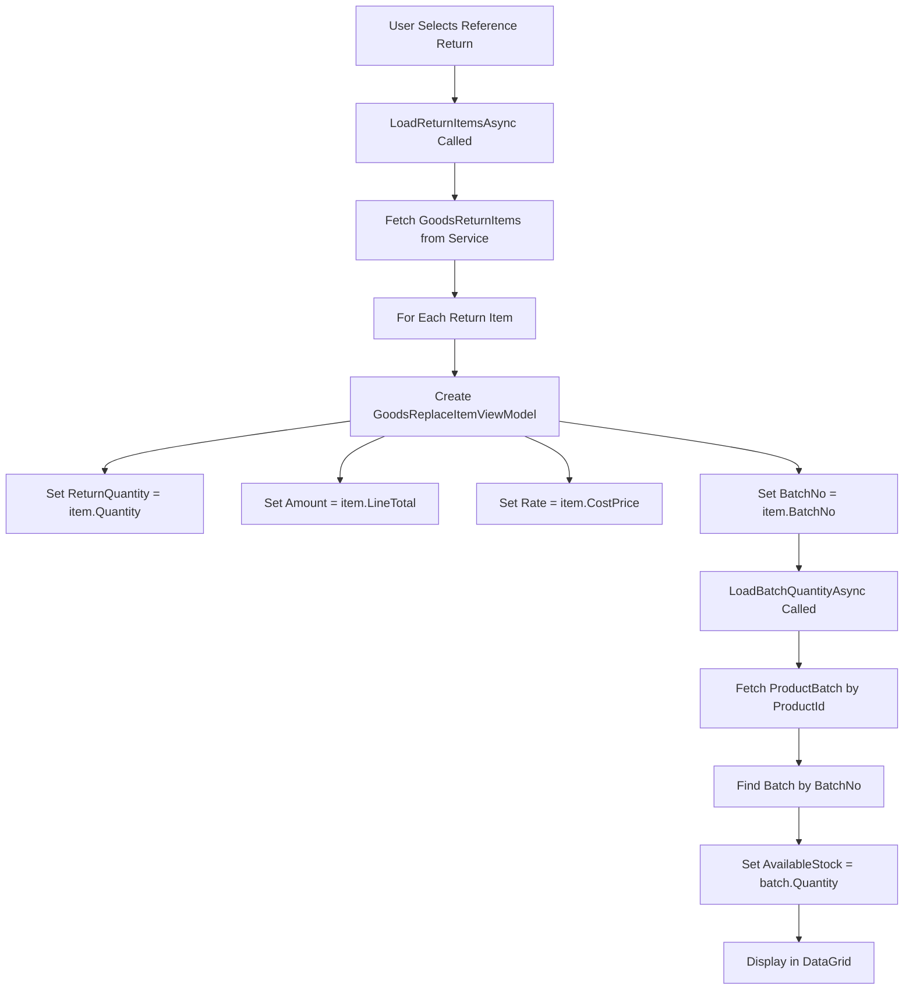

# Goods Replace Items Section - Logic Explanation

## Overview
This document explains the implementation of the Replacement Items section and the complete saving logic for Goods Replace functionality.

---

## 📊 Replacement Items Section - Data Flow

### 1. **Column Structure** (as per requirements)

The Replacement Items DataGrid now has the following columns:

| Column | Source | Editable | Description |
|--------|--------|----------|-------------|
| **Product** | Dropdown | ✅ Yes | Product selection from database |
| **Batch No** | GoodsReturn → Batch | ✅ Yes | Batch number (editable dropdown) |
| **Expiry Date** | GoodsReturn | ❌ No | Read-only expiry date |
| **Return Qty** | **GoodsReturnItem.Quantity** | ❌ No | **Quantity from Goods Return** (read-only) |
| **Replace Qty** | User Input | ✅ Yes | Replacement quantity to be sent |
| **Available Qty** | **ProductBatch.Quantity** | ❌ No | **Available qty from batch** (read-only) |
| **UOM** | Dropdown | ✅ Yes | Unit of measurement |
| **Rate** | GoodsReturn.CostPrice | ✅ Yes | Rate per unit |
| **Amount** | **GoodsReturnItem.LineTotal** | ✅ **Yes** | **Editable amount** (from LineTotal) |
| **Remarks** | User Input | ✅ Yes | Line-level remarks |
| **Actions** | Remove Button | - | Delete item row |

---

## 🔄 Data Loading Flow

### When Reference Return is Selected:



### Code Implementation:

```csharp
// In AddGoodsReplaceViewModel.cs - LoadReturnItemsAsync()
foreach (var item in returnItems)
{
    var replaceItemVm = new GoodsReplaceItemViewModel(...)
    {
        ProductId = item.ProductId,
        ProductName = item.ProductName,
        UomId = (int)item.UomId,
        UomName = item.UomName,
        BatchNo = item.BatchNo,
        ExpiryDate = item.ExpiryDate,
        
        // ✅ Return Quantity from Goods Return Item
        ReturnQuantity = item.Quantity,
        
        // ✅ Replacement quantity (user will enter)
        Quantity = 0,
        
        // Rate from Goods Return
        Rate = item.CostPrice,
        
        // ✅ Amount from LineTotal (EDITABLE)
        Amount = item.LineTotal,
        
        ReferenceReturnItemId = item.Id,
        Remarks = string.Empty
    };

    // ✅ Load Available Qty from Batch
    await replaceItemVm.LoadBatchQuantityAsync();
    
    ReplaceItems.Add(replaceItemVm);
}
```

---

## 🎯 Key Properties in GoodsReplaceItemViewModel

```csharp
public partial class GoodsReplaceItemViewModel : ObservableObject
{
    // Source: GoodsReturnItem.Quantity
    [ObservableProperty]
    private decimal returnQuantity = 0; // ✅ NEW: Quantity from goods return
    
    // User Input: Replacement quantity
    [ObservableProperty]
    private decimal quantity = 0; // User enters how much to replace
    
    // Source: ProductBatch.Quantity (based on BatchNo)
    [ObservableProperty]
    private decimal availableStock = 0; // ✅ Available quantity from batch
    
    // Source: GoodsReturnItem.CostPrice
    [ObservableProperty]
    private decimal rate = 0;
    
    // Source: GoodsReturnItem.LineTotal (EDITABLE)
    [ObservableProperty]
    private decimal amount = 0; // ✅ Editable amount
}
```

---

## 🔧 LoadBatchQuantityAsync Method

```csharp
/// <summary>
/// Load available quantity from the specific batch
/// </summary>
public async Task LoadBatchQuantityAsync()
{
    if (ProductId.HasValue && !string.IsNullOrEmpty(BatchNo))
    {
        try
        {
            // Fetch all batches for the product
            var batches = await _productBatchService
                .GetProductBatchesByProductIdAsync(ProductId.Value);
            
            // Find the specific batch by BatchNo
            var batch = batches.FirstOrDefault(b => b.BatchNo == BatchNo);
            
            if (batch != null)
            {
                // ✅ Set AvailableStock from batch.Quantity
                AvailableStock = batch.Quantity;
                
                AppLogger.LogInfo(
                    $"Loaded batch quantity: {AvailableStock} for batch {BatchNo}", 
                    "ViewModel", 
                    "viewmodel");
            }
            else
            {
                AvailableStock = 0;
                AppLogger.LogWarning(
                    $"Batch {BatchNo} not found for product {ProductId}", 
                    "ViewModel", 
                    "viewmodel");
            }
            
            CheckStockWarning();
        }
        catch (Exception ex)
        {
            AppLogger.LogError(
                $"Error loading batch quantity: {ex.Message}", 
                ex, 
                "viewmodel");
        }
    }
}
```

### When Batch Changes:

```csharp
partial void OnBatchNoChanged(string value)
{
    // When batch changes, reload the batch quantity
    if (!string.IsNullOrEmpty(value) && ProductId.HasValue)
    {
        _ = LoadBatchQuantityAsync(); // ✅ Auto-reload available qty
    }
}
```

---

## 💾 Saving Logic - Complete Flow

### 1. **Frontend - ViewModel Save**

```csharp
// In AddGoodsReplaceViewModel.cs - SaveReplaceAsync()
private async Task SaveReplaceAsync(string saveStatus)
{
    try
    {
        IsLoading = true;
        StatusMessage = "Saving replacement...";

        // Create DTO for API
        var replaceDto = new CreateGoodsReplaceDto
        {
            SupplierId = (int)SupplierId!.Value,
            StoreId = StoreId!.Value,
            ReferenceReturnId = ReferenceReturnId,
            ReplaceDate = ReplaceDate,
            Status = saveStatus, // "Draft" or "Posted"
            Remarks = Remarks,
            
            // Map items
            Items = ReplaceItems.Select(item => new CreateGoodsReplaceItemDto
            {
                ProductId = item.ProductId!.Value,
                UomId = item.UomId!.Value,
                BatchNo = item.BatchNo,
                ExpiryDate = item.ExpiryDate,
                Quantity = item.Quantity, // Replacement quantity
                Rate = item.Rate,
                // ✅ Amount is sent from the editable field
                // Note: Backend calculates it as Quantity × Rate
                ReferenceReturnItemId = item.ReferenceReturnItemId,
                RemarksLine = item.Remarks
            }).ToList()
        };

        if (IsEditMode)
        {
            // Update existing replace
            await _goodsReplaceService.UpdateGoodsReplaceAsync(
                _replaceId!.Value, 
                replaceDto);
            AppLogger.LogInfo($"Updated Goods Replace: {ReplaceNo}", "ViewModel", "viewmodel");
        }
        else
        {
            // Create new replace
            await _goodsReplaceService.CreateGoodsReplaceAsync(replaceDto);
            AppLogger.LogInfo($"Created Goods Replace: {ReplaceNo}", "ViewModel", "viewmodel");
        }

        MessageBox.Show(
            $"Goods Replacement {(IsEditMode ? "updated" : "created")} successfully!",
            "Success",
            MessageBoxButton.OK,
            MessageBoxImage.Information);

        _navigateBack?.Invoke();
    }
    catch (Exception ex)
    {
        AppLogger.LogError($"Error saving goods replace: {ex.Message}", ex, "viewmodel");
        ValidationMessage = $"Error saving: {ex.Message}";
        HasValidationErrors = true;
    }
    finally
    {
        IsLoading = false;
        StatusMessage = string.Empty;
    }
}
```

---

### 2. **Backend - Service Layer**

#### **CreateGoodsReplaceAsync Method:**

```csharp
// In GoodsReplaceService.cs
public async Task<GoodsReplaceDto> CreateGoodsReplaceAsync(CreateGoodsReplaceDto dto)
{
    try
    {
        // 1. Generate Replace Number (GR00001, GR00002, etc.)
        var replaceNo = await GenerateReplaceNumberAsync();
        
        // 2. Calculate Total Amount
        var totalAmount = dto.Items.Sum(item => item.Quantity * item.Rate);
        
        // 3. Create GoodsReplace Entity
        var replace = new GoodsReplace
        {
            ReplaceNo = replaceNo,
            SupplierId = dto.SupplierId,
            StoreId = dto.StoreId,
            ReferenceReturnId = dto.ReferenceReturnId,
            ReplaceDate = dto.ReplaceDate,
            TotalAmount = totalAmount, // ✅ Auto-calculated
            Status = dto.Status, // "Draft" or "Posted"
            Remarks = dto.Remarks,
            CreatedBy = 1, // TODO: Get from current user context
            CreatedAt = DateTime.UtcNow,
            UpdatedAt = DateTime.UtcNow
        };
        
        // 4. Save Replace Header
        _context.GoodsReplaces.Add(replace);
        await _context.SaveChangesAsync();
        
        // 5. Process Each Item
        foreach (var itemDto in dto.Items)
        {
            // ✅ ONLY IF STATUS IS "POSTED" - Update Stock
            if (dto.Status == "Posted")
            {
                // 5a. Increase Product Stock
                await IncreaseProductStockAsync(
                    itemDto.ProductId, 
                    itemDto.Quantity);
                
                // 5b. Add/Update Product Batch
                if (!string.IsNullOrEmpty(itemDto.BatchNo))
                {
                    await AddOrUpdateProductBatchAsync(
                        itemDto.ProductId, 
                        itemDto.BatchNo, 
                        itemDto.ExpiryDate,
                        itemDto.Quantity,
                        itemDto.Rate);
                }
            }
            
            // 6. Create GoodsReplaceItem Entity
            var item = new GoodsReplaceItem
            {
                ReplaceId = replace.Id,
                ProductId = itemDto.ProductId,
                UomId = itemDto.UomId,
                BatchNo = itemDto.BatchNo,
                ExpiryDate = itemDto.ExpiryDate,
                Quantity = itemDto.Quantity,
                Rate = itemDto.Rate,
                // Amount is calculated as Quantity × Rate in DB
                ReferenceReturnItemId = itemDto.ReferenceReturnItemId,
                RemarksLine = itemDto.RemarksLine,
                CreatedAt = DateTime.UtcNow
            };
            
            _context.GoodsReplaceItems.Add(item);
        }
        
        // 7. Save All Items
        await _context.SaveChangesAsync();
        
        // 8. Return Created Replace
        return await GetGoodsReplaceByIdAsync(replace.Id)
            ?? throw new InvalidOperationException("Failed to retrieve created goods replace");
    }
    catch (Exception ex)
    {
        AppLogger.LogError("CreateGoodsReplaceService", ex, 
            $"Error creating goods replace | Exception: {ex.Message}", 
            "goods_replace");
        throw;
    }
}
```

---

### 3. **Stock Update Logic**

#### **IncreaseProductStockAsync Method:**

```csharp
private async Task IncreaseProductStockAsync(int productId, decimal quantity)
{
    // Find the product
    var product = await _context.Products.FindAsync(productId);
    if (product != null)
    {
        // ✅ Increase stock quantities
        product.QuantityInStock += quantity;
        product.AvailableStock += quantity;
        product.UpdatedAt = DateTime.UtcNow;
        
        AppLogger.LogInfo("IncreaseProductStock", 
            $"Increased stock for Product {productId} by {quantity}. " +
            $"New stock: {product.QuantityInStock}", 
            "goods_replace");
    }
}
```

#### **AddOrUpdateProductBatchAsync Method:**

```csharp
private async Task AddOrUpdateProductBatchAsync(
    int productId, 
    string batchNo, 
    DateTime? expiryDate, 
    decimal quantity, 
    decimal rate)
{
    // Check if batch exists
    var existingBatch = await _context.ProductBatches
        .FirstOrDefaultAsync(pb => 
            pb.ProductId == productId && 
            pb.BatchNo == batchNo);
    
    if (existingBatch != null)
    {
        // ✅ Update existing batch
        existingBatch.Quantity += quantity;
        existingBatch.CostPrice = rate;
        existingBatch.UpdatedAt = DateTime.UtcNow;
        
        AppLogger.LogInfo("UpdateProductBatch", 
            $"Updated batch {batchNo} for Product {productId}. " +
            $"Added {quantity}, New total: {existingBatch.Quantity}", 
            "goods_replace");
    }
    else
    {
        // ✅ Create new batch
        var newBatch = new ProductBatch
        {
            ProductId = productId,
            BatchNo = batchNo,
            ExpiryDate = expiryDate,
            Quantity = quantity,
            UomId = 1, // Default UOM
            CostPrice = rate,
            Status = "Active",
            CreatedAt = DateTime.UtcNow,
            UpdatedAt = DateTime.UtcNow
        };
        
        _context.ProductBatches.Add(newBatch);
        
        AppLogger.LogInfo("CreateProductBatch", 
            $"Created new batch {batchNo} for Product {productId} with quantity {quantity}", 
            "goods_replace");
    }
}
```

---

## 📝 Complete Save Flow Diagram

```
┌─────────────────────────────────────────────────────────────┐
│ USER CLICKS "SAVE DRAFT" OR "POST REPLACE"                  │
└────────────────────────┬────────────────────────────────────┘
                         │
                         ▼
┌─────────────────────────────────────────────────────────────┐
│ Frontend: AddGoodsReplaceViewModel.SaveReplaceAsync()       │
│                                                              │
│  1. Validate form data                                      │
│  2. Create CreateGoodsReplaceDto                            │
│     - Map all header fields                                 │
│     - Map all items with:                                   │
│       • ProductId, UomId, BatchNo, ExpiryDate              │
│       • Quantity (replacement qty)                          │
│       • Rate                                                │
│       • ReferenceReturnItemId                              │
│  3. Call service: CreateGoodsReplaceAsync()                 │
└────────────────────────┬────────────────────────────────────┘
                         │
                         ▼
┌─────────────────────────────────────────────────────────────┐
│ Backend: GoodsReplaceService.CreateGoodsReplaceAsync()      │
│                                                              │
│  STEP 1: Generate Replace Number                            │
│  ├─ Query database for max ReplaceNo                        │
│  └─ Generate: GR00001, GR00002, etc.                        │
│                                                              │
│  STEP 2: Calculate Total Amount                             │
│  └─ Sum(Quantity × Rate) for all items                      │
│                                                              │
│  STEP 3: Create GoodsReplace Entity                         │
│  ├─ Set ReplaceNo, SupplierId, StoreId, etc.               │
│  ├─ Set TotalAmount (auto-calculated)                      │
│  ├─ Set Status ("Draft" or "Posted")                       │
│  └─ Save to database                                        │
│                                                              │
│  STEP 4: Process Items                                      │
│  For each item:                                             │
│  ├─ IF Status = "Posted":                                  │
│  │   ├─ Call IncreaseProductStockAsync()                   │
│  │   │   └─ Product.QuantityInStock += Quantity            │
│  │   └─ Call AddOrUpdateProductBatchAsync()                │
│  │       ├─ Find batch by ProductId + BatchNo              │
│  │       ├─ If exists: batch.Quantity += Quantity          │
│  │       └─ If not: Create new ProductBatch                │
│  │                                                          │
│  └─ Create GoodsReplaceItem entity                         │
│      └─ Save to database                                    │
│                                                              │
│  STEP 5: Return Created Replace                             │
│  └─ Query and return GoodsReplaceDto with all details      │
└────────────────────────┬────────────────────────────────────┘
                         │
                         ▼
┌─────────────────────────────────────────────────────────────┐
│ SUCCESS RESPONSE                                             │
│                                                              │
│  - Show success message                                     │
│  - Navigate back to Stock Management                        │
│  - Refresh Goods Replace list                               │
└─────────────────────────────────────────────────────────────┘
```

---

## 🔑 Key Differences: Draft vs Posted

| Aspect | Draft Status | Posted Status |
|--------|-------------|---------------|
| **Save to DB** | ✅ Yes | ✅ Yes |
| **Increase Product Stock** | ❌ No | ✅ Yes |
| **Update Batch Quantity** | ❌ No | ✅ Yes |
| **Editable After Save** | ✅ Yes | ❌ No |
| **Stock Movement** | ❌ No | ✅ Yes |

### Logic:
```csharp
// Only update stock if status is Posted
if (dto.Status == "Posted")
{
    await IncreaseProductStockAsync(itemDto.ProductId, itemDto.Quantity);
    
    if (!string.IsNullOrEmpty(itemDto.BatchNo))
    {
        await AddOrUpdateProductBatchAsync(...);
    }
}
```

---

## 📊 Database Tables Affected

### 1. **GoodsReplaces** (Header)
- New row created with auto-generated ReplaceNo
- TotalAmount auto-calculated from items
- Status = "Draft" or "Posted"

### 2. **GoodsReplaceItems** (Items)
- One row per item
- Links to GoodsReplace via ReplaceId
- Links to original return via ReferenceReturnItemId

### 3. **Products** (Only if Posted)
- QuantityInStock increased by replacement quantity
- AvailableStock increased by replacement quantity

### 4. **ProductBatches** (Only if Posted + BatchNo exists)
- Existing batch: Quantity increased
- New batch: Created with initial quantity

---

## 🎯 Summary of Implementation

### ✅ What Was Changed:

1. **Added ReturnQuantity Property**
   - Shows the original quantity from Goods Return
   - Read-only display in DataGrid

2. **Changed Available Qty Source**
   - NOW: Comes from `ProductBatch.Quantity` (based on BatchNo)
   - BEFORE: Came from StockLevel total stock

3. **Made Amount Editable**
   - Initialized from `GoodsReturnItem.LineTotal`
   - User can modify the amount
   - Removed auto-calculation (Amount = Qty × Rate)

4. **Added LoadBatchQuantityAsync Method**
   - Fetches batch by ProductId and BatchNo
   - Sets AvailableStock from batch.Quantity
   - Auto-called when BatchNo changes

5. **Updated DataGrid Columns**
   - Return Qty (read-only, from GoodsReturn)
   - Replace Qty (editable, user input)
   - Available Qty (read-only, from batch)
   - Amount (editable, from LineTotal)

### ✅ Saving Logic:
- Frontend validates and creates DTO
- Backend auto-generates ReplaceNo
- Backend auto-calculates TotalAmount
- **If Status = "Posted"**: Stock and batches updated
- **If Status = "Draft"**: Only saves records, no stock changes

---

## 🔍 Testing Checklist

- [ ] Select Reference Return → Items load with ReturnQuantity
- [ ] Check Available Qty shows batch quantity
- [ ] Check Amount is pre-filled from LineTotal
- [ ] Edit Amount → Total updates
- [ ] Change Batch → Available Qty updates
- [ ] Save as Draft → No stock changes
- [ ] Post Replace → Stock increases
- [ ] Verify batch quantity increases
- [ ] Check product stock increases
- [ ] Verify ReplaceNo is auto-generated

---

**Last Updated:** October 5, 2025  
**Implementation Status:** ✅ Complete
